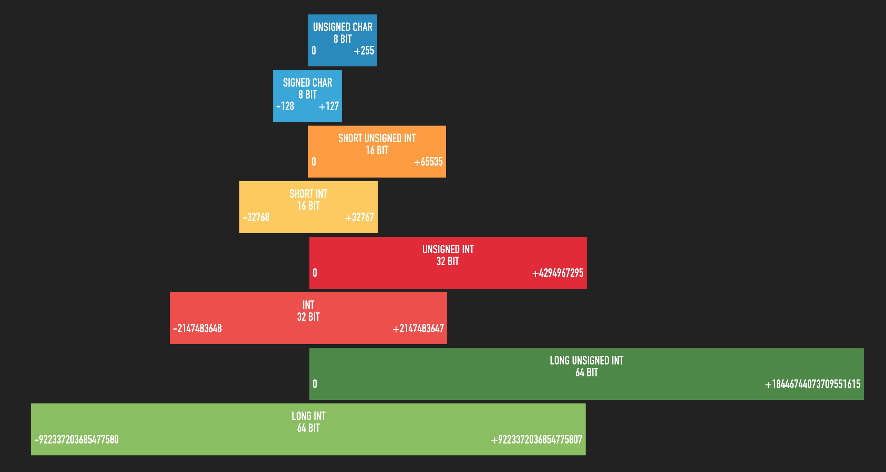

# Data Types - Part 1 - Basic Data Types

This chapter may sound easy and it also kind of is easy, but still many SW errors are due to wrong data types or wrong
interpretation of data. It's actually a very important topic.

## Basic Data Types

C has data types in various sizes for signed integers, unsigned integers and floating point values.
The sizes (bit width) partially depend on the system for which code is compiled. On a 16 bit computer the data types may
have different sizes compared to a 64 bit computer.

Here an example graphic and remember 1Byte == 8Bits

Read and run the datatypes.c file and learn which data types exist, how large they are and which min and max values they
can hold on your system.

## Nibble, Byte, Word
A quick side note just in case you come across these words. We know a Byte is 8 Bits. There is also the so called
*nibble* which is 4 Bits. And there is also the term *word* which depends on the architecure of your system. If we talk
about a 16 Bit microcontroller then a word is 16 Bit, which is 2 Bytes. If your system is 32 Bits wide then a *word* is
4 Bytes, and so on.

## Interpretation

Every value, and they all are just a bunch of 1s and 0s, needs to be interpreted, and this is done by providing each
value a data type information.
When we write ...

    int Foo;

... then we know the number of bytes used for this variable `Foo` and we know how the 1s and 0s need to be interpreted.

We will talk later about the [binary number system](https://en.cppreference.com/w/c/io/fprint://en.wikipedia.org/wiki/Binary_number) and
[`printf`](https://en.cppreference.com/w/c/io/fprintf) but here an example regarding interpretation of value.

Compile and run the `interpretation.c` file.

You may have noticed latest now that I used various characters in the *printf format string*. Here is an excerpt of the
*printf* documentation to show some of the formatting characters. More on that topic in a later chapter.

char   | meaning
-------|---------------------------------------------------------
`%c`   | writes a single character
`%s`   | writes a character string
`%d`   | converts a signed integer into decimal representation
`%ld`  | converts a long signed integer into decimal representation
`%lld` | converts a long long signed integer into decimal representation
`%u`   | converts an unsigned integer into decimal representation
`%lu`  | converts an long unsigned integer into decimal representation
`%llu` | converts an long long unsigned integer into decimal representation
`%f`   | converts a floating-point number (`float`) to the decimal notation
`%lf`  | converts a floating-point number (`double`) to the decimal notation
`%Lf`  | converts a floating-point number (`long double`) to the decimal notation

***

> **Core Message**
>
> Be always aware of what you are doing, of the data type sizes, value interpretation and the
> respective data ranges. Select the right data type for the purpose you need.
